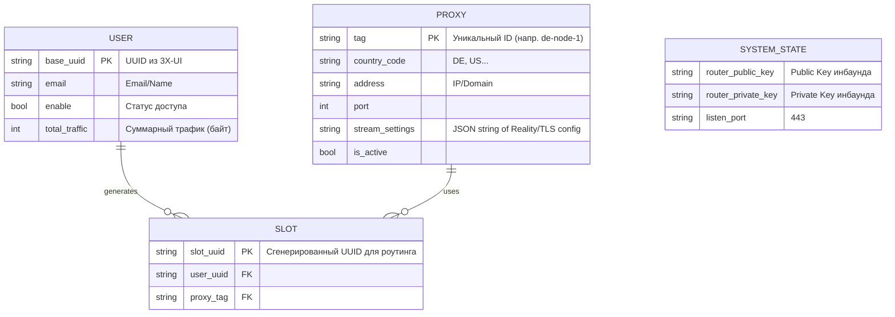

Вот окончательное, максимально подробное Техническое Задание (ТЗ), готовое к передаче разработчику. Оно объединяет все обсуждения, использует профессиональный подход к управлению состоянием (Hot Reload) и детально описывает структуру данных.

---

# Техническое задание на разработку системы "Proxy Manager"
**Язык реализации:** Go (предпочтительно) или Rust.
**Назначение:** Автоматизированная система управления доступом к внешним прокси-серверам с функцией балансировки, учета трафика и цензуроустойчивости.

---

## 1. Архитектура системы

### 1.1 Общая схема (Data Flow)

```mermaid
flowchart TD
    subgraph "Внешние источники данных"
        A[3X-UI Panel API] 
        B[Remnawave Subscription URL]
    end

    subgraph "Proxy Manager (Application)"
        direction TB
        C[Sync Worker\n(Periodic Task)]
        D[State Engine\n(In-Memory + Persist)]
        E[Xray API Client\n(gRPC)]
        F[Subscription Server\n(HTTP)]
        
        C -- "1. Fetch Data" --> A
        C -- "1. Fetch Data" --> B
        C -- "2. Update State" --> D
        D -- "3. Apply Changes" --> E
        F -- "4. Read State" --> D
    end

    subgraph "Xray Core (Router)"
        G[Main Inbound\nVLESS+Reality]
        H[Outbounds\n(Dynamic Proxies)]
        I[Routing Rules\n(User->Outbound)]
        J[Stats Counter]
    end

    subgraph "Клиенты"
        K[Happ App]
    end

    %% Connections
    E -- "gRPC: Add/Remove Users & Rules" --> G
    E -- "gRPC: Add Outbounds" --> H
    E -- "gRPC: Query Stats" --> J
    
    K -- "HTTP GET /sub/uuid" --> F
    K -- "Connect (VLESS+Vision)" --> G
    G -- "Route by UUID" --> H
```

### 1.2 Принцип работы (Logic Flow)
1.  **Идентификация:** Пользователи берутся из 3X-UI. Это "базовые" UUID.
2.  **Виртуализация:** Для каждого пользователя создается набор "слотов" — по одному UUID на каждый прокси. Это позволяет пользователю выбирать страну выхода в приложении.
3.  **Динамичность:** Управление Xray происходит через gRPC API без перезагрузок (Hot Reload), что исключает разрывы соединений.
4.  **Учет:** Статистика трафика собирается опросом Xray и агрегируется по базовому UUID пользователя.

---

## 2. Модель данных (ERD)

Приложение должно поддерживать актуальное состояние в памяти и, опционально, сохранять snapshot в SQLite/файл для быстрого старта.



---

## 3. Детали реализации Xray Core

### 3.1 Статическая часть конфигурации (`config.json`)
Файл конфигурации создается один раз при старте (или менеджером, или вручную). Он содержит "скелет".

```json
{
  "log": { "loglevel": "warning" },
  "stats": {},
  "api": {
    "tag": "api",
    "services": ["HandlerService", "StatsService", "RouterService"]
  },
  "policy": {
    "system": {
      "statsInboundUplink": true,
      "statsInboundDownlink": true
    },
    "levels": {
      "0": {
        "statsUserUplink": true,
        "statsUserDownlink": true
      }
    }
  },
  "inbounds": [
    {
      "tag": "main-in",
      "port": 443,
      "protocol": "vless",
      "settings": {
        "clients": [], // Управляется через API (AddUser/RemoveUser)
        "decryption": "none"
      },
      "streamSettings": {
        "network": "tcp",
        "security": "reality",
        "realitySettings": {
          "dest": "www.microsoft.com:443",
          "serverNames": ["www.microsoft.com", "google.com"],
          "privateKey": "GENERATED_PRIVATE_KEY", // Генерируется менеджером 1 раз
          "shortIds": ["", "0123"]
        }
      }
    },
    {
      "tag": "api",
      "listen": "127.0.0.1",
      "port": 10085,
      "protocol": "dokodemo-door",
      "settings": { "address": "127.0.0.1" }
    }
  ],
  "outbounds": [
    // Динамически управляются через API (AddOutbound)
    // Но нужно оставить "direct" или "block" для сервисных нужд
    { "tag": "direct", "protocol": "freedom" },
    { "tag": "block", "protocol": "blackhole" }
  ],
  "routing": {
    "domainStrategy": "IPIfNonMatch",
    "rules": [
      // 1. Правило для API (обязательно первым)
      { "type": "field", "inboundTag": ["api"], "outboundTag": "api" },
      
      // 2. Динамические правила пользователей (управляются через API)
      // Пример: { "type": "field", "user": ["slot-uuid-1"], "outboundTag": "proxy-de" }
      
      // 3. Default Deny
      { "type": "field", "ip": ["geoip:private"], "outboundTag": "block" }
    ]
  }
}
```

### 3.2 Динамическое управление (gRPC API)

Разработчик должен реализовать клиент, использующий прото-файлы из репозитория Xray-core.

#### А. Добавление пользователя (New Friend / New Slot)
1.  **Метод:** `AddUser` (через `HandlerService`).
2.  **Inbound Tag:** `main-in`.
3.  **Payload:**
    ```json
    {
      "email": "user-tag@proxy-tag", // Для удобства логирования
      "id": "slot-uuid-v5(user, proxy)",
      "flow": "xtls-rprx-vision"
    }
    ```
4.  **Действие:** Xray сразу начнет принимать соединения с этим UUID.

#### Б. Маршрутизация (Binding Slot to Proxy)
1.  **Метод:** `AddRule` (через `RouterService`).
2.  **Payload:**
    ```json
    {
      "type": "field",
      "user": ["slot-uuid-v5(user, proxy)"],
      "outboundTag": "proxy-tag"
    }
    ```
3.  **Важно:** Правила добавляются в начало списка правил (чтобы они сработали раньше дефолтных).

#### В. Добавление нового Прокси (New Outbound)
1.  **Метод:** `AddOutbound`.
2.  **Payload:** Полный JSON конфиг исходящего соединения (VLESS + Reality), где `tag` = `proxy-tag`.
3.  **Логика:** При обновлении подписки Remnawave менеджер добавляет новые аутбаунды.

#### Г. Удаление (Decommission)
*   **Пользователь ушел:** `RemoveUser` -> `RemoveRule`. Доступ закрывается мгновенно.
*   **Прокси исчез:** Помечаем как неактивный. Удаляем правила (`RemoveRule`), ссылающиеся на него. Аутбаунд можно оставить до след. рестарта или удалить через `RemoveOutbound`, если он свободен.

---

## 4. Алгоритмы работы (Workflow)

### 4.1 Генерация UUID-слотов (Slot Generation)
Для стабильности конфигурации UUID пользователя для конкретного прокси не должен меняться при перезапусках.
**Формула:** `SlotUUID = UUIDv5(BaseUserUUID + ProxyTag)`.
Это гарантирует, что для пары "Алекс + Германия" всегда будет генерироваться один и тот же UUID.

### 4.2 Процедура "Горячего" Обновления (Hot Update Cycle)
Запускается по таймеру (напр. каждые 5 минут).

**Шаг 1: Сбор данных**
*   Получить список `Users` из 3X-UI API.
*   Получить список `Proxies` из Remnawave Sub.

**Шаг 2: Вычисление разницы (Diff)**
*   Сравнить полученные списки с текущим состоянием (`State Engine`).
*   Определить:
    *   `New Users` (появились в 3X-UI).
    *   `Removed Users` (удалены из 3X-UI).
    *   `New Proxies` (появились в подписке).
    *   `Removed Proxies` (пропали из подписки).

**Шаг 3: Применение изменений (gRPC Calls)**
1.  **Если `New Proxy`:**
    *   Сгенерировать `Outbound Config`.
    *   Вызвать `AddOutbound`.
    *   Для всех активных `Users`: сгенерировать `SlotUUID`, вызвать `AddUser`, вызвать `AddRule`.
2.  **Если `New User`:**
    *   Для всех активных `Proxies`: сгенерировать `SlotUUID`, вызвать `AddUser`, вызвать `AddRule`.
3.  **Если `Removed User`:**
    *   Найти все его `Slots` в памяти.
    *   Для каждого слота: вызвать `RemoveUser`, `RemoveRule`.
4.  **Если `Removed Proxy`:**
    *   Найти все `Slots`, привязанные к этому прокси.
    *   Вызвать `RemoveRule` (пользователи теряют доступ к этому узлу).
    *   Вызвать `RemoveUser` (удаляем слоты).
    *   (Опционально) Удалить `Outbound`.

### 4.3 Сбор статистики (Statistics Collector)
Запускается отдельным легковесным потоком (раз в 1-2 минуты).

1.  Вызвать `QueryStats` (Request: `pattern: ""`, `reset: false`).
2.  Разобрать ответ. Нас интересуют записи вида:
    *   `user>>>slot-uuid-alex-de>>>traffic>>>uplink`
    *   `user>>>slot-uuid-alex-de>>>traffic>>>downlink`
3.  **Агрегация:** Найти в памяти базового пользователя для этого слота. Прибавить значения к его счетчикам `total_uplink` / `total_downlink`.
4.  Сохранить обновленные значения в БД/файл.

---

## 5. API Менеджера (для друзей)

Менеджер должен поднять HTTP сервер (порт 80 или 8080).

### Endpoint: `GET /sub/:user_base_uuid`
**Описание:** Возвращает конфигурацию для клиента Happ в формате JSON.

**Логика:**
1.  Найти пользователя в `State Engine` по `base_uuid`.
2.  Если не найден -> HTTP 404.
3.  Сформировать JSON массив. Для каждого активного прокси:
    *   `name`: Имя прокси (напр. "🇩🇪 Germany 01").
    *   `type`: "vless".
    *   `server`: IP/Domain маршрутизатора.
    *   `server_port`: 443.
    *   `uuid`: **SlotUUID** (сгенерированный для этого прокси).
    *   `flow`: "xtls-rprx-vision".
    *   `security`: "reality".
    *   `server_name`: "www.microsoft.com".
    *   `reality_public_key`: Публичный ключ маршрутизатора.

**Пример ответа:**
```json
[
  {
    "name": "DE Node",
    "type": "vless",
    "server": "1.2.3.4",
    "server_port": 443,
    "uuid": "slot-uuid-for-de",
    "flow": "xtls-rprx-vision",
    "security": "reality",
    "server_name": "www.microsoft.com",
    "reality_public_key": "RouterPublicKeyString"
  },
  {
    "name": "US Node",
    // ... параметры для US
    "uuid": "slot-uuid-for-us"
  }
]
```

---

## 6. Требования к реализации (Non-functional)

1.  **Стек:** Go (предпочтительно из-за отличной поддержки gRPC и простоты кросс-компиляции) или Rust.
2.  **Протоколы:** gRPC клиент для общения с Xray (proto-файлы: `app/proxyman/command/command.proto`, `app/stats/command/command.proto`).
3.  **Хранение данных:** SQLite (для персистентности статистики и состояния) или in-memory с сохранением в JSON файл.
4.  **Обработка ошибок:** Если Xray перезагружался (например, обновление бинарника), Менеджер должен обнаружить потерю соединения и провести полную синхронизацию (Full Sync) заново.
5.  **Логирование:** Подробные логи действий (Добавлен пользователь X, Удален прокси Y, Ошибка API Z).

Это ТЗ дает разработчику исчерпывающую информацию для реализации системы любого уровня сложности, от простого скрипта до полноценного демона.
