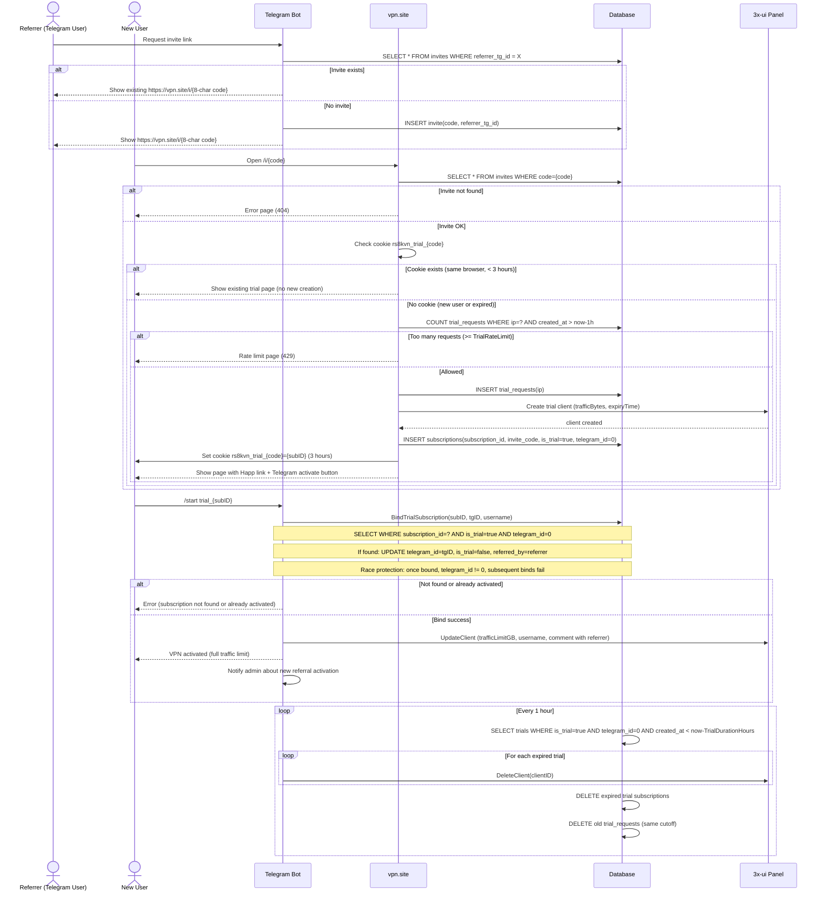
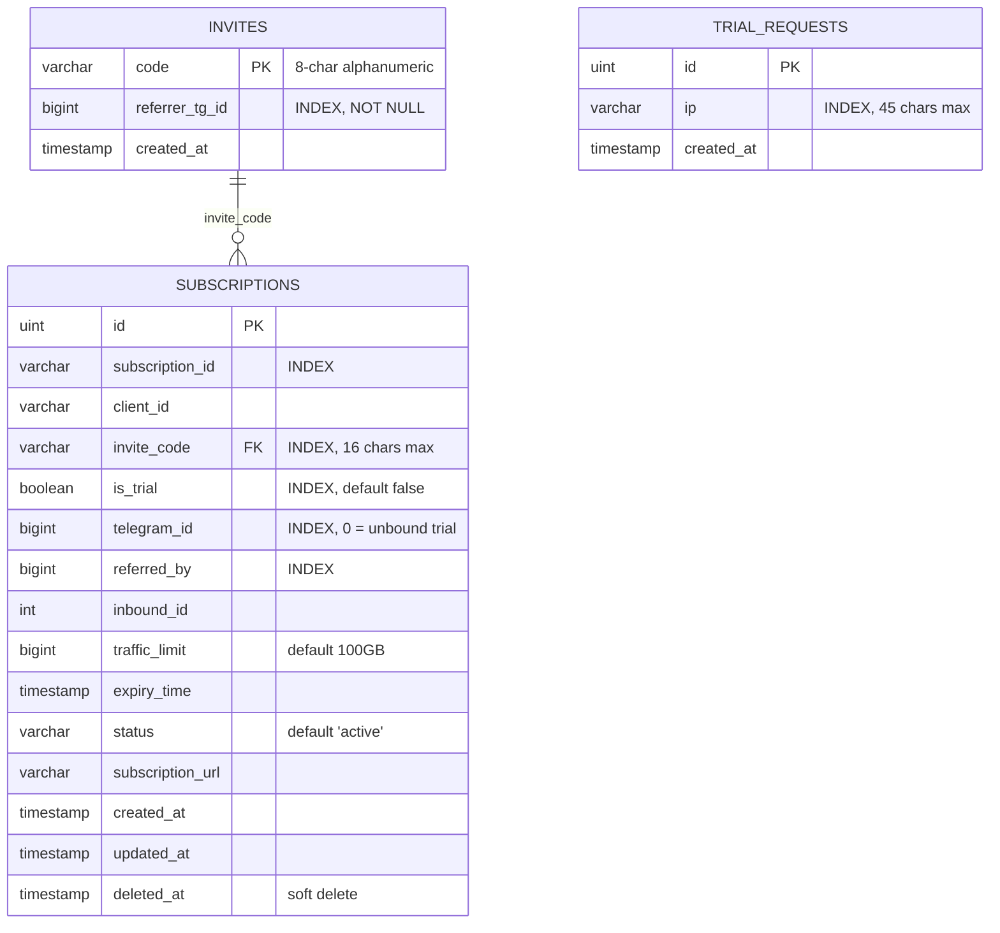
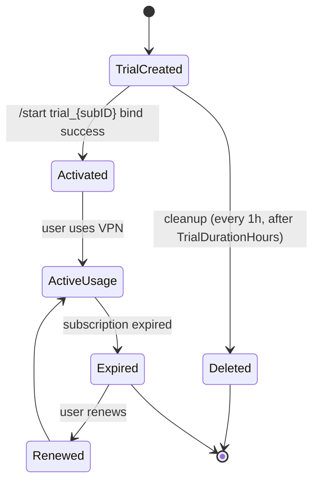

# VPN Trial + Referral Flow — Sequence Diagram



# VPN Referral System — ER Diagram



## Связи

* Один invite может создать много trial подписок
* SUBSCRIPTIONS.invite_code → INVITES.code
* SUBSCRIPTIONS.referred_by — это referrer_tg_id пригласившего (копируется из INVITES)
* TRIAL_REQUESTS не связан FK — это rate limit лог
* Неактивированные trial подписки имеют telegram_id = 0 (не NULL — SQLite имеет особенности с NULL)

---

# Subscription State Diagram



## Описание состояний

### TrialCreated

* subscription создан через web по invite ссылке
* is_trial = true
* telegram_id = 0 (не NULL)
* Трафик: минимум 1 GB, срок: TrialDurationHours (по умолчанию 3ч)
* В xui создаётся клиент с email `trial_{subID}`

### Activated

* bind выполнен через `/start trial_{subID}`
* telegram_id установлен на ID пользователя
* is_trial = false
* referred_by записан (referrer_tg_id из invites)
* В xui: лимит увеличен до TrafficLimitGB (по умолчанию 100GB), username обновлён

### ActiveUsage

* пользователь активно пользуется VPN

### Expired

* срок подписки закончился

### Renewed

* пользователь продлил подписку

### Deleted

* trial не был активирован и удалён hourly cleanup
* Удаляется и из БД, и из xui панели

---

# Главный принцип

Trial → либо Activated → либо Deleted

Нет других веток.

Это делает систему:

* простой
* предсказуемой
* легко масштабируемой

---

# Конфигурация

| Переменная | По умолчанию | Описание |
|-----------|-------------|----------|
| `SITE_URL` | `https://vpn.site` | Базовый URL для ссылок |
| `TRIAL_DURATION_HOURS` | `3` | Время жизни неактивированного trial (1-168) |
| `TRIAL_RATE_LIMIT` | `3` | Макс. trial с одного IP в час (1-100) |
| `TRAFFIC_LIMIT_GB` | `100` | Лимит трафика после активации |
| `XUI_HOST` | — | URL 3x-ui панели |
| `XUI_USERNAME` | — | Логин панели |
| `XUI_PASSWORD` | — | Пароль панели |

---

## Критичные нюансы

### Trial Duplication Prevention

**Проблема:** Пользователь обновляет страницу → создаётся новая trial подписка.

**Решение:** HttpOnly cookie `rs8kvn_trial_{invite_code}` на 3 часа.

**Поведение:**
- ✅ Refresh страницы = та же подписка (кука найдена)
- ✅ Разные пользователи = разные подписки (разные браузеры/куки)
- ✅ Одно устройство = максимум 1 trial за 3 часа
- ✅ После активации (telegram_id != 0) кука не мешает

**Реализация:**
```go
// internal/web/web.go
cookie, err := r.Cookie("rs8kvn_trial_" + code)
if err == nil {
    // Кука есть — найти существующий trial
    existingSub, _ := s.db.GetTrialSubscriptionBySubID(ctx, cookie.Value)
    if existingSub != nil && !existingSub.IsActivated() {
        // Показать существующий, не создавать новый
        return s.renderTrialPage(existingSub, ...)
    }
}

// Создать новый trial и установить куку
http.SetCookie(w, &http.Cookie{
    Name:     "rs8kvn_trial_" + code,
    Value:    subID,
    Path:     "/i/" + code,
    Expires:  time.Now().Add(3 * time.Hour),
    HttpOnly: true,
    Secure:   true,
    SameSite: http.SameSiteStrictMode,
})
```
