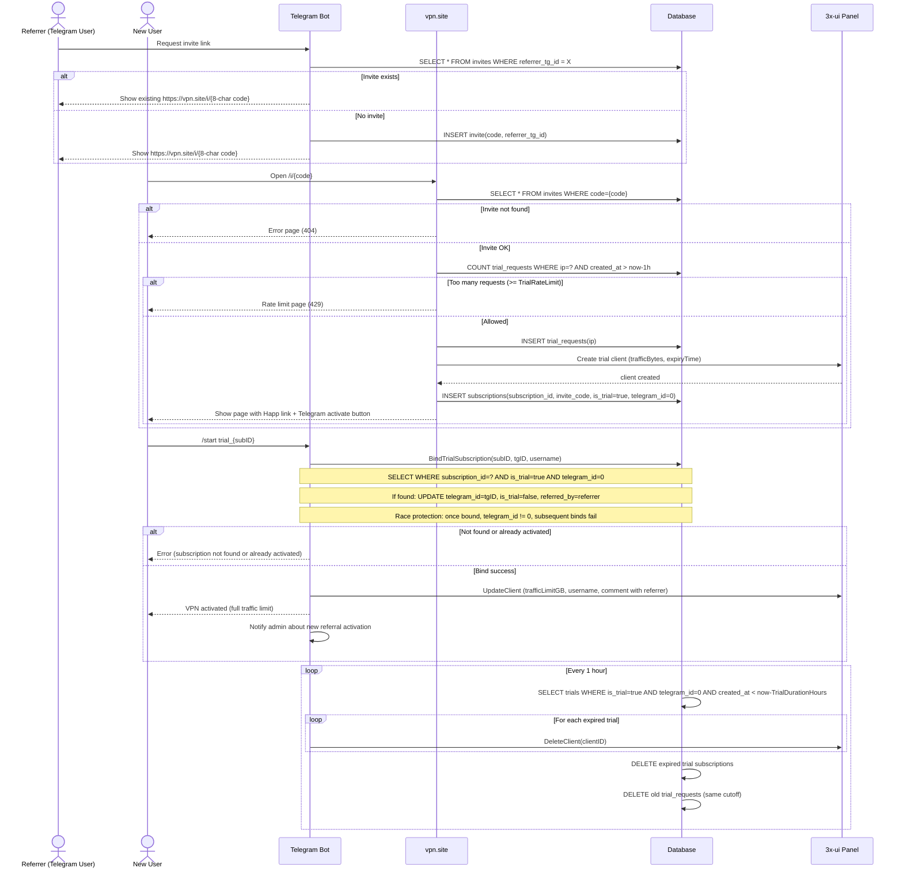
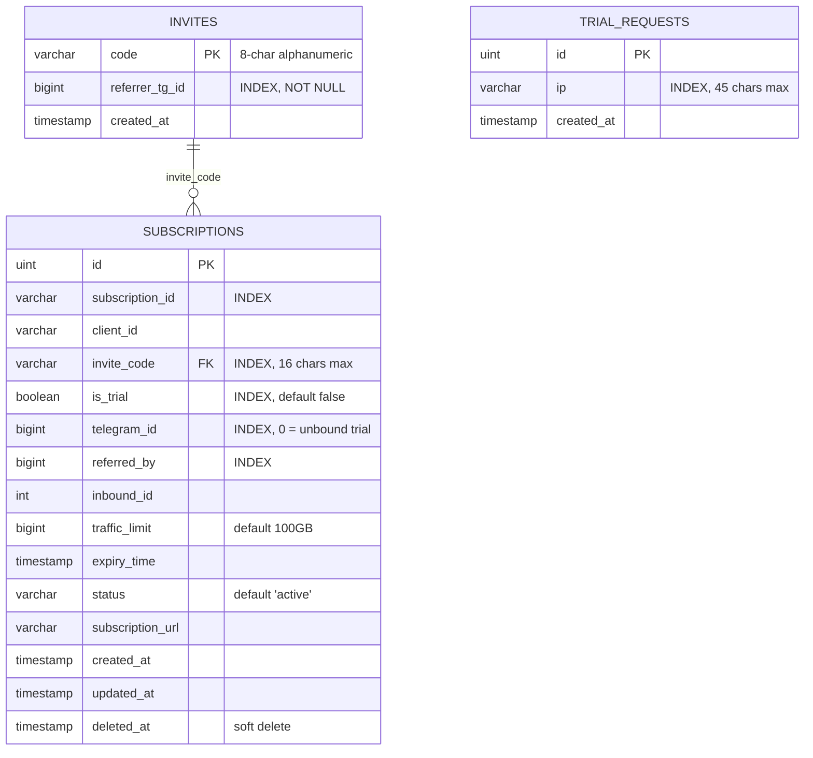
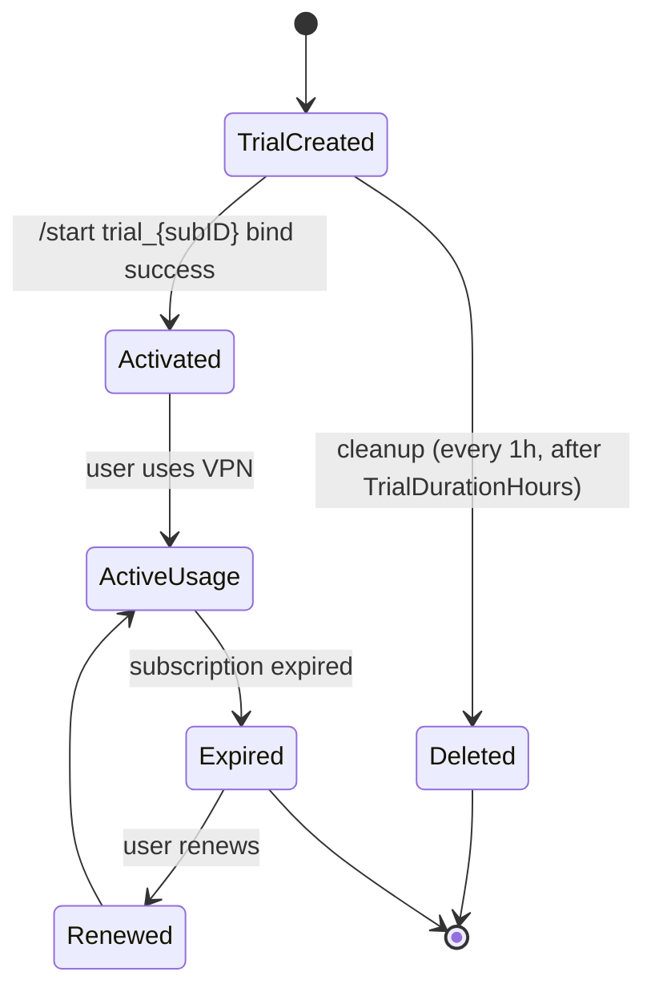

# VPN Trial + Referral Flow — Sequence Diagram

# VPN Referral System — ER Diagram

## Связи

* Один invite может создать много trial подписок
* SUBSCRIPTIONS.invite_code → INVITES.code
* SUBSCRIPTIONS.referred_by — это referrer_tg_id пригласившего (копируется из INVITES)
* TRIAL_REQUESTS не связан FK — это rate limit лог
* Неактивированные trial подписки имеют telegram_id = 0 (не NULL — SQLite имеет особенности с NULL)

---

# Subscription State Diagram

## Описание состояний

### TrialCreated

* subscription создан через web по invite ссылке
* is_trial = true
* telegram_id = 0 (не NULL)
* Трафик: минимум 1 GB, срок: TrialDurationHours (по умолчанию 3ч)
* В xui создаётся клиент с email `trial_{subID}`

### Activated

* bind выполнен через `/start trial_{subID}`
* telegram_id установлен на ID пользователя
* is_trial = false
* referred_by записан (referrer_tg_id из invites)
* В xui: лимит увеличен до TrafficLimitGB (по умолчанию 100GB), username обновлён

### ActiveUsage

* пользователь активно пользуется VPN

### Expired

* срок подписки закончился

### Renewed

* пользователь продлил подписку

### Deleted

* trial не был активирован и удалён hourly cleanup
* Удаляется и из БД, и из xui панели

---

# Главный принцип

Trial → либо Activated → либо Deleted

Нет других веток.

Это делает систему:

* простой
* предсказуемой
* легко масштабируемой

---

# Конфигурация

| Переменная | По умолчанию | Описание |
|-----------|-------------|----------|
| `SITE_URL` | `https://vpn.site` | Базовый URL для ссылок |
| `TRIAL_DURATION_HOURS` | `3` | Время жизни неактивированного trial (1-168) |
| `TRIAL_RATE_LIMIT` | `3` | Макс. trial с одного IP в час (1-100) |
| `TRAFFIC_LIMIT_GB` | `100` | Лимит трафика после активации |
| `XUI_HOST` | — | URL 3x-ui панели |
| `XUI_USERNAME` | — | Логин панели |
| `XUI_PASSWORD` | — | Пароль панели |

---

# Известные проблемы

## 1. Race condition на bind (P1)
`internal/database/database.go` — `BindTrialSubscription` делает SELECT и UPDATE без транзакции. Два конкурентных `/start trial_xxx` могут оба пройти SELECT, затем второй перезапишет первого.

**Фикс:** SELECT + UPDATE в транзакции, или `UPDATE ... WHERE telegram_id = 0` с проверкой RowsAffected.

## 2. Слабая генерация subID в web handler (P1)
`internal/web/web.go` — локальный `generateSubID()` использует `time.Now().UnixNano()%16` (предсказуемо). В `utils/uuid.go` есть `GenerateSubID()` с `crypto/rand`.

**Фикс:** Заменить на `utils.GenerateSubID()`.

## 3. Rollback использует неправильный ID (P1)
`internal/web/web.go` — `DeleteClient` получает `subID` (14-char hex) вместо `clientID` (UUID). Rollback не удалит клиента из xui.

**Фикс:** Передавать `clientID` в `DeleteClient`.

## 4. Rate limit fails open (P2)
Если БД вернула ошибку при `CountTrialRequestsByIPLastHour` — rate limit пропускается.

**Фикс:** Логировать и показывать ошибку пользователю при сбое проверки.

## 5. Trial page хардкодит "3 часа" (P3)
HTML-шаблон `renderTrialPage` содержит захардкоженный текст вместо динамического `TrialDurationHours`.

## 6. Dead code — проверка "Already activated" (P3)
`internal/bot/commands.go` — `if sub.IsTrial` после `BindTrialSubscription` никогда не true, т.к. метод уже установил `IsTrial = false`.

## 7. Web handler не переиспользует xui клиент (P3)
Каждый запрос `handleInvite` создаёт новый `xui.NewClient()` + логин. Поле `s.xuiClient` используется только для health check.

---

# Технические детали

## Генерация invite кода
`internal/utils/uuid.go` — `GenerateInviteCode()`
- 8 символов, `0-9a-z`, `crypto/rand`
- Пример: `a3f7b2c1`

## Генерация subscription ID (bot)
`internal/utils/uuid.go` — `GenerateSubID()`
- 10 символов hex, `crypto/rand` (5 случайных байт)
- Используется при обычной подписке

## Генерация subscription ID (web — проблемный)
`internal/web/web.go` — `generateSubID()`
- 14 символов hex, `time.Now().UnixNano()%16` + `time.Sleep(Nanosecond)`
- **Не криптостойкий**, нужно заменить на `utils.GenerateSubID()`

## Web landing page
`GET /i/{code}` → `internal/web/web.go:handleInvite`

Отображает:
- Ссылки на скачивание Happ (Android + iOS)
- Кнопка "Добавить в Happ" с `happ://add/{subURL}`
- Кнопка копирования subscription URL
- Кнопка "Активировать" → `https://t.me/{bot}?start=trial_{subID}`
- Информация о сроке trial

## Bind flow
`/start trial_{subID}` → `internal/bot/commands.go:handleBindTrial`

1. `BindTrialSubscription(subID, chatID, username)` — атомарный bind
2. `UpdateClient` в xui — обновление лимитов и username
3. Уведомление админа о новой реферальной активации

## Cleanup scheduler
`cmd/bot/main.go:startTrialCleanupScheduler`
- Интервал: каждый час
- Порог: `TrialDurationHours` (по умолчанию 3ч)
- Удаляет: подписки из БД + клиентов из xui + старые trial_requests

## Миграции
| # | Файл | Назначение |
|---|------|-----------|
| 000 | `000_create_subscriptions.up.sql` | Базовая таблица subscriptions |
| 001 | `001_replace_xuihost_with_subscription_id.up.sql` | Stub (миграция в Go коде) |
| 002 | `002_add_invites_and_trials.up.sql` | Таблицы invites + trial_requests |
| 003 | `003_add_referral_columns.up.sql` | Колонки invite_code, is_trial, referred_by |
